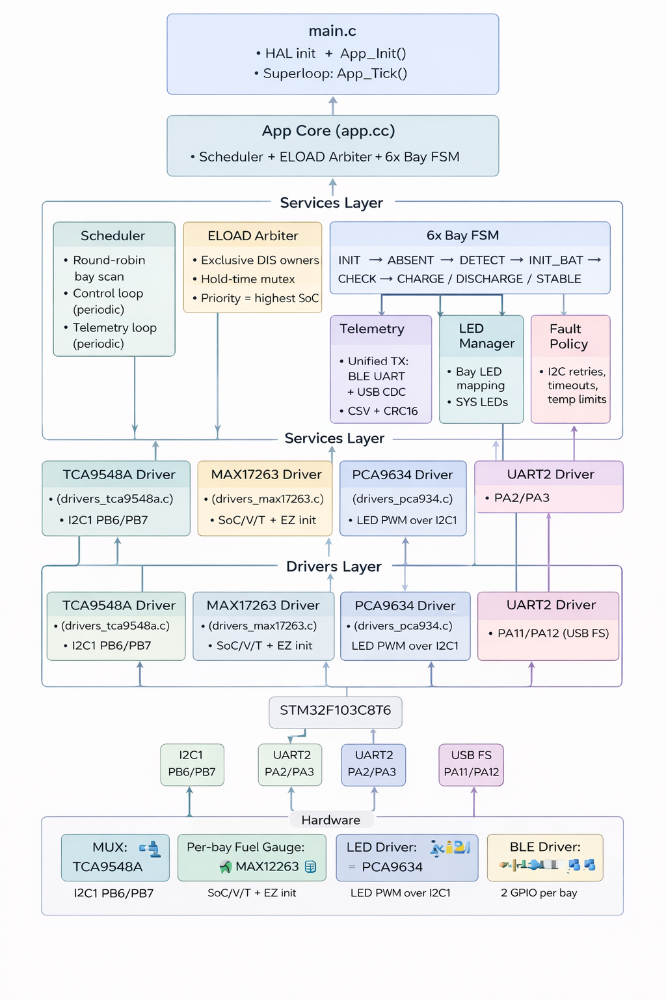

# ⚡ Skadi 6-Bay Smart Charger — v1.0 

> Plateforme de gestion intelligente pour 6 packs Li-ion 2S (Excel 2EXL1505 / Skadi).
> Système open hardware permettant la charge et décharge automatique pour atteindre ~30% SoC (conformité IATA/UN 3480).


---

## 📋 Vue d'ensemble

Les transporteurs internationaux (UPS, FedEx, DHL, etc.) n'acceptent pas l'expédition de batteries Li-ion **> 30 % SoC** en raison des risques thermiques.

Le **Skadi 6-Bay Smart Charger** permet de **ramener automatiquement chaque batterie au seuil de ~30 % SoC**, qu'elle soit initialement trop basse (charge) ou trop haute (décharge via ELOAD externe).

### Fonctionnalités principales

- ✅ **6 baies indépendantes** avec contrôle charge/décharge par MOSFET
- ✅ **Supervision I²C** via multiplexeur TCA9548A + répéteurs TCA9803
- ✅ **Fuel gauge MAX17263** intégré dans chaque pack (SoC, température, tension)
- ✅ **Machine à états finie (FSM)** avec initialisation automatique ModelGauge m5 EZ
- ✅ **Télémétrie BLE** (HC-08) + UART + USB CDC
- ✅ **Affichage LED** par baie via driver PCA9634
- ✅ **Watchdog matériel** (WWDG) pour sécurité

---

## 🔧 Architecture matérielle

### Alimentation
- **Entrée**: 12V DC (fusible 12A rapide)
- **Buck 3.3V**: TPS562200 (12V → 3.3V, 2A)
- **Protection**: TVS, NTC, condensateurs bulk

### Microcontrôleur
- **MCU**: STM32F103C8Tx (ARM Cortex-M3, 48 pins)
- **Horloge**: 16 MHz (cristal externe HSE)
- **Watchdog**: WWDG (Window Watchdog) avec refresh toutes les 10ms
- **Interfaces**:
  - USB 2.0 Type-C (protection USBLC6-2SC6)
  - SWD (Tag-Connect TC2030-NL)
  - UART2 (115200 baud, BLE HC-08)
  - I²C1 (100 kHz)
  - ADC1 (mesure tension 12V)

### Gestion des baies (×6)

Chaque baie dispose de:
- **Commutation charge**: P-MOSFET AO4407A + driver N-MOSFET DMG2302U
- **Commutation décharge**: P-MOSFET AO4407A + driver N-MOSFET DMG2302U
- **Répéteur I²C**: TCA9803 (isolation 3.3V ↔ pack)
- **Protection**: Diodes 1N4148WT, résistances de limitation
- **Points de test**: CHG_GATE, DIS_GATE
- **Connecteur**: 2 broches pogo pins (BAT+/BAT-)

### Multiplexage I²C
- **Circuit**: TCA9548APWR (8 canaux, 6 utilisés)
- **Fonction**: Communication I²C individuelle avec chaque pack
- **Pull-ups**: 2.2kΩ sur bus principal, 10kΩ sur multiplexeur

### Pilotage des LEDs
- **Driver**: PCA9634PW (8 canaux PWM)
- **Résistances**: 680Ω par LED
- **Contrôle**: Via I²C depuis MCU

---

## 🧠 Architecture Firmware




### Structure du code

```
firmware/
├── Core/
│   ├── Src/
│   │   ├── main.c              # Point d'entrée, init périphériques
│   │   ├── stm32f1xx_it.c      # Interruptions
│   │   └── system_stm32f1xx.c  # Config système
│   └── Inc/
├── App/
│   ├── app.c                   # Machine à états principale
│   ├── app_config.h            # Constantes (seuils, timeouts)
│   ├── board_io.c              # Abstraction GPIO/ADC
│   ├── drivers_tca9548a.c      # Driver MUX I²C
│   ├── drivers_max17263.c      # Driver fuel gauge
│   ├── drivers_pca9634.c       # Driver LEDs
│   ├── services_cmd.c          # Parser commandes BLE/UART
│   ├── services_led.c          # Logique LEDs
│   ├── services_telemetry.c    # Télémétrie UART/USB
│   └── services_identity.c     # UID unique STM32
└── USB_DEVICE/                 # Stack USB CDC
```

### Boucle principale (main.c)

```c
void main(void) {
  HAL_Init();
  SystemClock_Config();  // HSE 16MHz → PLL 48MHz
  
  // Init périphériques
  MX_GPIO_Init();
  MX_ADC1_Init();
  MX_I2C1_Init();        // 100kHz
  MX_USART2_UART_Init(); // 115200 baud
  MX_WWDG_Init();        // Watchdog
  MX_USB_DEVICE_Init();  // CDC
  
  App_Init(&g_app);
  HAL_UART_Receive_IT(&huart2, &ble_rx_byte, 1);
  
  while(1) {
    if ((HAL_GetTick() - t0) >= 10ms) {  // Tick 10ms
      t0 = HAL_GetTick();
      App_Tick(&g_app);                  // FSM principale
      HAL_WWDG_Refresh(&hwwdg);          // Feed watchdog
    }
  }
}
```

### Machine à états finie (FSM)

Le firmware implémente une FSM par baie avec **scan round-robin** (une baie à la fois, cycle de 5s/baie).

#### États de la FSM

```
┌─────────────────────────────────────────────────────────────┐
│                     INIT (démarrage)                        │
│  • Config GPIO, I²C, MUX, LEDs                              │
│  • Reset tous les enable charge/décharge                    │
└──────────────────────┬──────────────────────────────────────┘
                       │
                       ▼
              ┌────────────────┐
              │    ABSENT      │◄────────────┐
              │ • Pack non     │             │
              │   détecté      │             │
              └────────┬───────┘             │
                       │ DET=1               │ DET=0
                       ▼                     │
              ┌────────────────┐             │
              │     CHECK      │─────────────┘
              │ • Lecture I²C  │
              │ • I²C timeout  │
              └────────┬───────┘
                       │ I²C OK
                       ▼
              ┌────────────────┐
              │   INIT_BAT     │ 
              │ • Gauge_EZ_Init│
              │ • Init modèle  │
              │   ModelGauge   │
              └────────┬───────┘
                       │
         ┌─────────────┼─────────────┐
         │             │             │
    SoC<28%       28≤SoC≤30.5    SoC>30.5%
         │             │             │
         ▼             ▼             ▼
   ┌─────────┐   ┌─────────┐   ┌──────────┐
   │ CHARGE  │   │ STABLE  │   │DISCHARGE │
   │ 12V ON  │   │ Repos   │   │ELOAD ON  │
   │         │   │ ~30%    │   │          │
   └────┬────┘   └────┬────┘   └────┬─────┘
        │             │             │
        │ SoC≥30.5    │ Drift       │ SoC≤30.5
        └─────────────┼─────────────┘
                      ▼
                ┌──────────┐
                │  STABLE  │
                └──────────┘
                      │
                      │ Temp>45°C, I²C fail, timeout
                      ▼
                ┌──────────┐
                │  FAULT   │
                │ OFF all  │
                └──────────┘
```

#### Description des états

| État | Description | Transitions |
|------|-------------|-------------|
| **INIT** | Initialisation système, reset des GPIO | → ABSENT (pack absent)<br>→ CHECK (pack détecté) |
| **ABSENT** | Pack non détecté (DET=0 ou I²C NACK) | → CHECK (insertion pack) |
| **CHECK** | Lecture I²C initiale, vérification température | → INIT_BAT (I²C OK)<br>→ FAULT (I²C fail > 3×) |
| **INIT_BAT** | **Initialisation ModelGauge m5 EZ**<br>• Appel `Gauge_EZ_Init()`<br>• Configuration fuel gauge | → CHARGE (SoC < 28%)<br>→ DISCHARGE (SoC > 30.5%)<br>→ STABLE (28% ≤ SoC ≤ 30.5%)<br>→ FAULT (erreur init) |
| **CHARGE** | 12V activé, charge CC/CV par BQ24610 | → STABLE (SoC ≥ 30.5%)<br>→ FAULT (timeout 25min, T>45°C) |
| **DISCHARGE** | ELOAD actif (une baie à la fois) | → STABLE (SoC ≤ 30.5%)<br>→ FAULT (timeout 20min, T>45°C) |
| **STABLE** | SoC autour de 30%, repos | → CHARGE (SoC < 28%)<br>→ DISCHARGE (SoC > 30.5%) |
| **FAULT** | Erreur (température, I²C, timeout) | → CHECK (récupération auto si T<40°C, I²C OK) |

### Paramètres d'exploitation (app_config.h)

```c
// Seuils SoC
#define SOC_LOW_START      28.0f    // Démarrer charge
#define SOC_STABLE_HIGH    30.5f    // Arrêter charge/décharge
#define SOC_DISCH_START    30.5f    // Démarrer décharge

// Seuils température
#define TEMP_MAX_C         45.0f    // Coupure sécurité
#define TEMP_RECOVER_C     40.0f    // Récupération auto

// Timeouts
#define CHG_TIMEOUT_MS     (25u * 60u * 1000u)  // 25 min
#define DIS_TIMEOUT_MS     (20u * 60u * 1000u)  // 20 min

// Périodes
#define SCAN_PERIOD_MS_PER_BAY  5000u   // 5s/baie
#define CTRL_PERIOD_MS          100u    // 100ms (FSM)
#define TELEMETRY_PERIOD_MS     5000u   // 5s

// I²C
#define I2C_RETRY_MAX          3u
#define I2C_RETRY_DELAY_MS     50u
```

### Arbitrage ELOAD

**Règle**: Une seule baie à la fois peut être connectée à l'ELOAD.

```c
void eload_select_set(app_t *a, uint8_t allow_dis[BAY_COUNT])
{
  // Sélectionner jusqu'à eload_slots baies (1 par défaut)
  // Prioriser la baie avec le SoC le plus élevé
  
  for (uint8_t slot = 0; slot < a->eload_slots; slot++) {
    float best_soc = SOC_DISCH_START;
    int best_bay = -1;
    
    for (uint8_t i = 0; i < BAY_COUNT; i++) {
      if (allow_dis[i]) continue;           // Déjà sélectionnée
      if (!bay[i].present || !bay[i].i2c_ok) continue;
      if (bay[i].state == BAY_S_FAULT) continue;
      if (bay[i].temp_c >= TEMP_MAX_C) continue;
      if (bay[i].soc <= SOC_DISCH_START) continue;
      
      if (bay[i].soc > best_soc) {
        best_soc = bay[i].soc;
        best_bay = i;
      }
    }
    
    if (best_bay >= 0) allow_dis[best_bay] = 1;
  }
}
```

### Initialisation ModelGauge m5 EZ

**État INIT_BAT**: Après détection du pack et lecture I²C réussie, le firmware initialise le fuel gauge:

```c
// drivers_max17263.c
HAL_StatusTypeDef Gauge_EZ_Init(void)
{
  // 1. Soft reset (optionnel)
  // i2c_w16(0x60, 0x000F);  // Command = 0x000F
  // HAL_Delay(200);
  
  // 2. Configuration ModelGauge m5 EZ
  // i2c_w16(0xDB, 0x8000);  // ModelCfg = 0x8000 (EZ mode)
  // HAL_Delay(2000);        // Attendre convergence modèle
  
  // 3. Paramètres pack (exemples)
  // i2c_w16(0x18, 3300);    // DesignCap = 3300 mAh
  // i2c_w16(0x23, 8400);    // VEmpty = 5.0V (2×2.5V)
  
  // Pour l'instant, retour OK (à compléter selon datasheet)
  return HAL_OK;
}
```

**Note**: L'implémentation complète sera finalisée avec les paramètres exacts du pack Excel 2EXL1505.

### Télémétrie

Format CSV avec CRC16-CCITT envoyé toutes les 5s par baie:

```
UID,<24_hex_chars>,TS,<ms>,BAY,<1-6>,ST,<état>,SOC_D10,<0.1%>,VCELL_MV,<mV>,TEMP_D10,<0.1°C>,PRES,<0|1>,I2C,<0|1>,ERR,<code>,ELOADS,<slots>,VIN_CV,<cV>,CRC,<hex>
```

**Exemple**:
```
UID,2A01C3F08B1D77AA0019FF10,TS,123456,BAY,3,ST,DIS,SOC_D10,472,VCELL_MV,7730,TEMP_D10,314,PRES,1,I2C,1,ERR,0,ELOADS,1,VIN_CV,1215,CRC,A3F2
```

### Commandes BLE/UART

Format texte simple:

```
ELOADS=<1-6>   # Nombre de baies ELOAD simultanées
MODE=30        # Mode ~30% SoC (défaut)
MODE=100       # Mode charge 100%
```

---

## 📊 Schémas du PCB

Le projet contient 7 pages de schémas KiCad:

1. **Page 1**: Vue d'ensemble (hiérarchie des feuilles)
2. **Page 2**: Alimentation 12V → Buck 3.3V
3. **Page 3**: MCU STM32F103C8T + USB + SWD + BLE
4. **Page 4**: Multiplexeur I²C TCA9548A
5. **Page 5**: Buck converter 3.3V (TPS562200)
6. **Page 6**: Baie #1 (répété ×6)
7. **Page 7**: Driver LEDs PCA9634

---

## 🛠️ Composants principaux

| Référence | Composant | Quantité | Description |
|-----------|-----------|----------|-------------|
| U1 | TPS562200 | 1 | Buck 12V→3.3V (2A) |
| U2 | TCA9803 | 6 | Répéteur I²C par baie |
| U3 | USBLC6-2SC6 | 1 | Protection USB |
| U4 | STM32F103C8Tx | 1 | MCU principal (48MHz) |
| U6 | TCA9548APWR | 1 | MUX I²C 8 canaux |
| IC1 | PCA9634PW | 1 | Driver LED 8 canaux |
| Q_CHG1/2 | AO4407A | 12 | P-MOSFET charge (×2/baie) |
| Q_DIS2 | AO4407A | 6 | P-MOSFET décharge |
| Q_CHG/DIS_DRV | DMG2302U | 12 | N-MOSFET driver |
| F1 | Fusible 12A | 1 | Protection entrée |
| D1 | TVS | 1 | Protection surtension |
| Y1 | Cristal 16MHz | 1 | Horloge externe HSE |
| L1 | Inductance 3.3µH | 1 | Buck converter |

---

## 🔌 Pinout MCU (STM32F103C8T)

### Contrôle baies
| Pin | Signal | Fonction |
|-----|--------|----------|
| PA0 | BAY1_CHG_EN | Enable charge baie 1 |
| PA1 | BAY2_CHG_EN | Enable charge baie 2 |
| PA2 | BAY3_CHG_EN | Enable charge baie 3 |
| PA3 | BAY4_CHG_EN | Enable charge baie 4 |
| PA4 | BAY1_DIS_EN | Enable décharge baie 1 |
| PA5 | BAY2_DIS_EN | Enable décharge baie 2 |
| PB0 | BAY5_CHG_EN | Enable charge baie 5 |
| PB1 | BAY6_CHG_EN | Enable charge baie 6 |
| PB10 | BAY6_DIS_EN | Enable décharge baie 6 |
| PB11 | BAY5_DIS_EN | Enable décharge baie 5 |
| PB12 | BAY4_DIS_EN | Enable décharge baie 4 |
| PB13 | BAY3_DIS_EN | Enable décharge baie 3 |

### Communication
| Pin | Signal | Fonction |
|-----|--------|----------|
| PB6 | I2C1_SCL | Horloge I²C (100kHz) |
| PB7 | I2C1_SDA | Données I²C |
| PA9 | UART_TX | TX vers BLE HC-08 |
| PA10 | UART_RX | RX depuis BLE HC-08 |
| PA11 | USB_D- | USB 2.0 D- |
| PA12 | USB_D+ | USB 2.0 D+ |

### Programmation/Debug
| Pin | Signal | Fonction |
|-----|--------|----------|
| PA13 | SWDIO | Serial Wire Debug I/O |
| PA14 | SWCLK | Serial Wire Clock |
| PB3 | SWO | Serial Wire Output |
| NRST | NRST | Reset (connecté à superviseur) |

### ADC
| Pin | Signal | Fonction |
|-----|--------|----------|
| PA0 | ADC_CH0 | Mesure tension 12V (diviseur 133k/33k) |

---

## 📐 Diagramme d'architecture

```
       12V DC Input (12A fusible)
              │
      ┌───────┴───────────┐
      │   Protection      │
      │ • TVS SMBJ15A     │
      │ • Bulk caps       │
      │                   │
      └───────┬───────────┘
              │
      ┌───────┴───────────────────┐
      │                           │
      ▼                           ▼
┌─────────────┐          ┌──────────────────┐
│ Buck 3.3V   │          │  6× Bay Switches │
│ TPS562200   │          │  AO4407A + DMG   │
│ (2A)        │          │  (12V high-side) │
└──────┬──────┘          └────────┬─────────┘
       │                          │
       ▼                          ▼
┌──────────────────┐      ┌──────────────┐
│  STM32F103C8T    │      │ Pogo Pins ×6 │
│  • 48MHz         │      │ (Batt packs) │
│  • WWDG          │      └──────────────┘
│  • 10ms tick     │              │
└────┬─────────────┘              │
     │                            │
     ├──► TCA9548A (I²C MUX) ─────┤
     │         │                  │
     │         └──► TCA9803 ×6 ───┘
     │              (Buffers)
     │
     ├──► PCA9634 (LED driver)
     │
     ├──► USB Type-C
     │
     └──► UART2 → HC-08 (BLE)
```

---

## 🚀 Utilisation

### Programmation (SWD)

1. Connecter programmeur ST-Link au header Tag-Connect (J2)
2. Pins: VCC, GND, SWDIO, SWCLK, NRST, SWO
3. Flasher avec STM32CubeIDE ou OpenOCD

```bash
# Exemple OpenOCD
openocd -f interface/stlink.cfg -f target/stm32f1x.cfg \
  -c "program firmware.elf verify reset exit"
```

### Configuration I²C

- **TCA9548A** (MUX): Adresse 0x70 (A2=A1=A0=0)
- **MAX17263** (Gauge): Adresse 0x6C (sur chaque canal MUX)
- **PCA9634** (LEDs): Adresse 0x15 (A6-A0 configurables)

### Contrôle via BLE/UART

Connecter terminal série (115200 baud, 8N1):

```
ELOADS=2       # Autoriser 2 baies ELOAD simultanées
MODE=30        # Mode ~30% SoC (défaut)
MODE=100       # Mode charge 100%
```

### Télémétrie

Recevoir les trames CSV toutes les 5s:

```python
import serial

ser = serial.Serial('/dev/ttyUSB0', 115200)
while True:
    line = ser.readline().decode('utf-8').strip()
    print(line)
    # Parser: UID,xxx,TS,yyy,BAY,z,...
```

---

## ⚡ Spécifications électriques

| Paramètre | Valeur | Notes |
|-----------|--------|-------|
| Tension d'entrée | 12V DC ±10% | 10.8V min, 13.2V max |
| Courant max | 12A | Fusible rapide |
| Tension logique | 3.3V ±5% | Buck TPS562200 |
| Courant par baie (charge) | ~1.1A @ 12V | Via BQ24610 interne pack |
| Fréquence I²C | 100 kHz | Standard mode |
| Fréquence UART | 115200 baud | 8N1, BLE HC-08 |
| Watchdog timeout | ~50ms | WWDG, refresh 10ms |
| Horloge système | 48 MHz | HSE 16MHz + PLL×6 |

---

## 🔒 Protections & Sécurité

| Protection | Implémentation | Réaction |
|------------|---------------|----------|
| **Surtension 12V** | TVS SMBJ15A | Écrêtage transitoires |
| **Surcourant** | Fusible 12A rapide | Coupure permanente |
| **Température pack** | MAX17263 + NTC | OFF charge/décharge si >45°C |
| **Watchdog** | WWDG matériel | Reset MCU si crash firmware |
| **Timeout charge** | Software, 25 min | → FAULT |
| **Timeout décharge** | Software, 20 min | → FAULT |
| **Erreur I²C** | 3 retry + isolation baie | → FAULT si persiste |
| **USB** | USBLC6-2SC6 | ESD protection |

---

## 🧪 Tests & Validation

### Checklist matérielle

- [ ] Continuité pistes 12V / GND
- [ ] Court-circuits (test DRC KiCad)
- [ ] Polarité condensateurs électrolytiques
- [ ] Orientation MOSFETs, diodes, ICs
- [ ] Soudure pogo pins

### Checklist firmware

- [ ] Communication I²C avec TCA9548A
- [ ] Sélection canaux MUX (0-5)
- [ ] Lecture MAX17263 (SoC, V, T)
- [ ] Initialisation ModelGauge m5 EZ
- [ ] Commutation MOSFETs charge/décharge
- [ ] Télémétrie UART/USB
- [ ] Watchdog (test crash volontaire)
- [ ] LEDs (états FSM)
- [ ] Commandes BLE

### Procédure de test

1. **Test bench**:
   - Alim 12V/12A
   - 6× packs Skadi (SoC variés: 20%, 35%, 50%, etc.)
   - ELOAD programmable (mode CC, 0.5-1A)
   - Multimètre, oscilloscope
   - Terminal série (UART/BLE)

2. **Scénarios**:
   - Pack vide (10%) → CHARGE → STABLE (30%)
   - Pack plein (80%) → DISCHARGE → STABLE (30%)
   - Insertion/retrait pack → transitions ABSENT/CHECK
   - Surchauffe simulée (chauffer NTC) → FAULT
   - Déconnexion I²C → FAULT après 3 retry

---

## 📂 Structure du dépôt

```
Skadi-6Bay-Charger/
├── hardware/
│   ├── 6_bay_charg.kicad_pcb       # Layout PCB
│   ├── 6_bay_charg.kicad_sch       # Schéma racine
│   ├── Power.kicad_sch             # Alim 12V/3.3V
│   ├── MCU.kicad_sch               # MCU + USB + SWD
│   ├── MUX.kicad_sch               # TCA9548A
│   ├── Buck_3.3V.kicad_sch         # TPS562200
│   ├── bay1.kicad_sch              # Baie type
│   ├── LEDs_driver.kicad_sch       # PCA9634
│   └── bom/                        # Bill of Materials
├── firmware/
│   ├── Core/
│   │   ├── Src/main.c
│   │   └── Inc/main.h
│   ├── App/
│   │   ├── app.c                   # FSM principale
│   │   ├── app_config.h            # Constantes
│   │   ├── board_io.c              # GPIO/ADC
│   │   ├── drivers_tca9548a.c
│   │   ├── drivers_max17263.c
│   │   ├── drivers_pca9634.c
│   │   ├── services_cmd.c
│   │   ├── services_led.c
│   │   ├── services_telemetry.c
│   │   └── services_identity.c
│   └── USB_DEVICE/
├── docs/
│   ├── eos_logo.png
│   ├── datasheets/
│   └── images/
├── README.md
└── LICENSE
```

---

## 🔧 Développement

### Prérequis

- **Hardware**: ST-Link V2/V3, alimentation 12V/12A
- **Software**:
  - STM32CubeIDE (ou Keil, IAR)
  - KiCad 7.0+
  - Terminal série (PuTTY, minicom)

### Build firmware

```bash
cd firmware
# Importer projet dans STM32CubeIDE
# Build → Release
# Flash via ST-Link
```

### Modification schémas

```bash
cd hardware
kicad 6_bay_charg.kicad_pro
# Modifier schémas
# Générer netlist
# Update PCB
```

---

## 🐛 Dépannage

| Problème | Cause probable | Solution |
|----------|----------------|----------|
| Pas de détection pack | Pogo pins mal alignés | Vérifier mécanique, continuité |
| I²C timeout | Pull-ups manquants/trop faibles | Ajouter 2.2kΩ, vérifier soudures TCA9803 |
| SoC erroné | MAX17263 non initialisé | Vérifier `Gauge_EZ_Init()`, lire ModelCfg |
| Reset MCU fréquent | Watchdog non rafraîchi | Vérifier tick 10ms
...


## 📌 Limitations connues & évolutions prévues

### Limitations actuelles (v1.0)

- 🔸 **Une seule ELOAD active à la fois**  
  Par défaut, une seule baie peut être connectée à la charge électronique externe pour la décharge.  
  👉 Ce comportement est **logiciel** et **configurable**.

- 🔸 **Pas de stockage persistant des statistiques**  
  Les cycles charge/décharge, fautes et durées ne sont pas encore sauvegardés en Flash interne.

- 🔸 **Interface utilisateur minimale**  
  Le système est volontairement headless (BLE / UART / USB CDC uniquement).

---

### Évolutions prévues (roadmap)

- 🔧 **Décharge multi-baies configurable**  
  Possibilité d’autoriser **N baies simultanées en décharge** (`ELOADS=<1..6>`), avec :
  - arbitrage dynamique,
  - respect du budget PSU,
  - priorisation par SoC.

- 💾 **Journalisation Flash (event log)**  
  Stockage persistant :
  - erreurs par baie,
  - durées de charge/décharge,
  - nombre de cycles.

- 📊 **Interface PC / Web**  
  - Outil desktop (USB CDC) ou web (BLE) pour :
    - monitoring temps réel,
    - export CSV,
    - mise à jour firmware.

- 🌡️ **Gestion thermique avancée**
  - Ventilateur PWM proportionnel,
  - réduction automatique du nombre de baies actives en cas de montée thermique.

- 🔐 **Sécurité & production**
  - CRC firmware,
  - versioning hardware/firmware,
  - numéro de série exposé via BLE/USB.

---

## 🧾 Conformité & usage prévu

- ✔️ **Conformité IATA / UN 3480**  
  Le mode **~30 % SoC** est spécifiquement conçu pour le transport aérien sécurisé.

- ⚠️ **Usage interne / professionnel**  
  Ce projet est destiné à un **environnement contrôlé** ( production, maintenance).  
  

---

## 📄 Licence

Ce projet est publié sous licence **MIT** :

- Utilisation libre (personnelle / commerciale)


Voir le fichier `LICENSE` pour le texte complet.

---

## 🤝 Contributions

Les contributions sont bienvenues :

- amélioration firmware (FSM, drivers),
- validation thermique,
- optimisation hardware,
- outils de monitoring.

Merci d’ouvrir une **issue** ou une **pull request** avec une description claire.

---

## ✍️ Auteur

**Takiyeddin Gherras**  


 

© 2026 EOS Positioning Systems 
